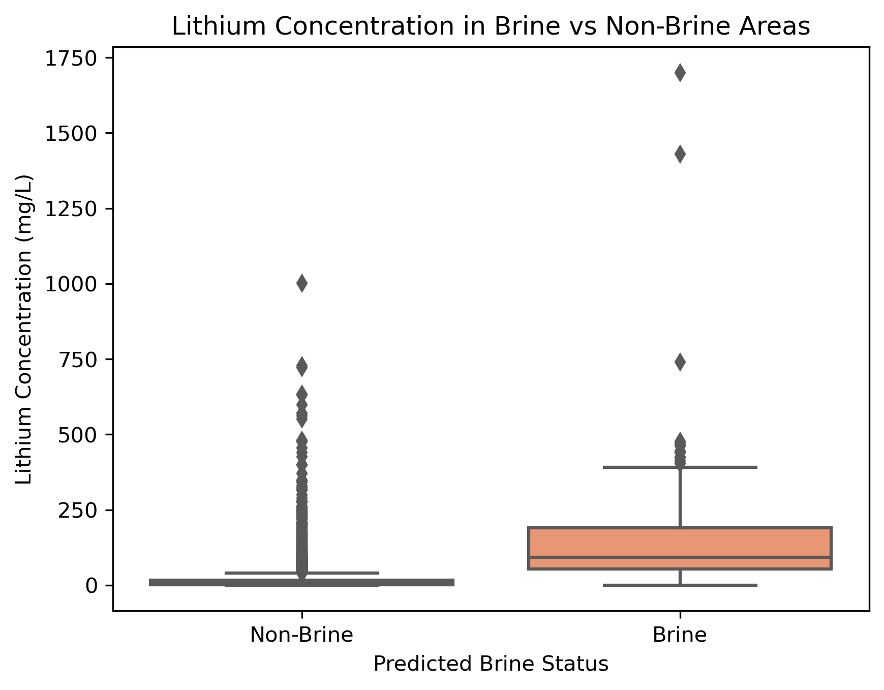
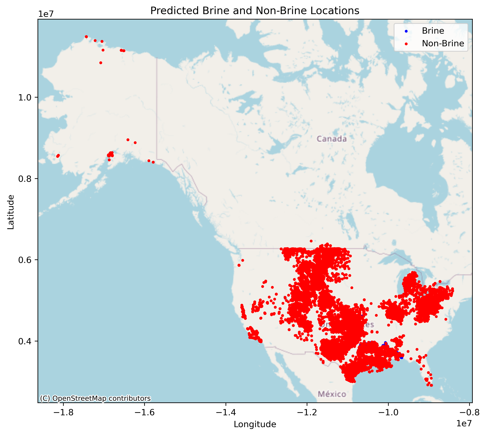

## Final Project: Highlighting the Scarcity of Brine Sources and the Future Potential of Oceanic Extraction from Machine Learning
Songdi Zhao

Department of Civil and Environmental Engineering

University of California, Los Angeles

November, 2024


In this final project, the machine learning techniques was applied to investigate the scarcity of the existing lithium brine sources and the limitations of other extraction methods, such as hard rock and clay. Below is my report.

***

## Introduction 

Lithium is a critical element for renewable energy technologies, powering batteries for electric vehicles and energy storage systems. However, due to the bloom of the EV Vechicle market, the demand for lithium is rapidly increasing, and its availability from traditional sources is limited. Current extraction methods primarily focus on continental brine reservoirs, which are geographically scarce, and hard rock or clay deposits, which are less readily accessible and often expensive to exploit.

The scarcity of brine reservoirs and the limitations of alternative sources present a significant challenge for sustainable lithium production. This problem is important because lithium supply bottlenecks could hinder the global transition to clean energy technologies and lead to economic and geopolitical tensions.

Fortunately, datasets such as the **USGS National Produced Waters Geochemical Database** provide valuable geochemical and spatial data related to lithium deposits. By leveraging these datasets, we can apply a machine learning approach to classify lithium sources and explore patterns in resource availability.

For this project, I applied a **supervised machine learning technique** using a Random Forest Classifier to analyze lithium sources. My approach involved:
1. Labeling brine and non-brine sources based on geological formations.
2. Training the model to predict brine classifications using geochemical and spatial features.
3. Evaluating the results to identify the scarcity of brine reservoirs and the challenges of accessing alternative sources.

After resolving the set approaches, we concluded that the existing brine lithium sources are indeed limited, and other sources such as hard rock and clay are less accessible or scalable for widespread extraction. These findings highlight the immense potential of further exploration of in-land and oceanic brine as a future lithium resource, motivating research into technologies like lithium-selective membranes (e.g., lithium selective MM membranes) to make seawater extraction viable.


## Data

The dataset for this project was sourced from the USGS National Produced Waters Geochemical Database, which offers detailed geochemical and spatial data on lithium concentrations across various geological formations in the United States. It includes critical features such as total dissolved solids (TDS), pH, temperature, depth, latitude, longitude, and formation names, which are essential for classifying lithium sources as brine or non-brine. The dataset comprises X samples, with lithium concentrations ranging from Z mg/L to W mg/L, and an average concentration of Y mg/L. Initial exploratory analysis revealed correlations between lithium concentration, TDS, and formation depth, highlighting these features' relevance to classification tasks.

To ensure compatibility with the machine learning model, several preprocessing steps were undertaken. Missing values in key features were imputed using median values, while irrelevant columns were excluded to improve data quality. Features were selected based on their geochemical and geological significance, including TDS, depth, and spatial attributes such as latitude and longitude. The geospatial distribution of lithium concentrations is visualized in Figure 1, demonstrating the variability and scarcity of lithium-rich regions across the United States. This dataset's comprehensive coverage provided a solid foundation for applying machine learning to analyze lithium resource availability and support future research directions. 


*Figure 1: Geospatial distribution of lithium concentrations across geological formations in the United States. The color scale represents lithium concentrations (mg/L), with higher concentrations indicated by lighter colors. Data points are overlaid on an OpenStreetMap basemap to visualize the spatial variability and scarcity of lithium-rich regions.*

As seen from the geospatial analysis of lithium concentrations in Figure 1, the distribution of lithium-rich regions is uneven. More specifically, the highest concentrations are localized in specific formations in the western and central United States, aligning with known brine reservoirs and geological basins. However, many regions with potentially significant lithium deposits remain underrepresented in the dataset, emphasizing the need for broader data collection efforts. The findings underscore the scarcity of accessible brine resources and the spatial constraints associated with extracting lithium from traditional sources.

## Modelling

To analyze the scarcity of lithium brine sources and classify lithium deposits, a supervised machine learning approach was deployed. The dataset from the USGS National Produced Waters Geochemical Database provided a variety of features such as TDS, pH, depth, latitude, and longitude, which are highly relevant for understanding the nature of lithium sources. A Random Forest Classifier was chosen for its robustness to overfitting, interpretability, and ability to handle mixed types of data.

The model was trained to classify lithium deposits as brine or non-brine based on labeled data. Labels were generated using domain knowledge, with geological formations containing keywords like "Brine," "Aquifer," or "Smackover" marked as brine sources. Features were carefully selected and preprocessed to ensure relevance and completeness, with missing values imputed using median values. The Random Forest Classifier was then optimized for performance using a grid search to fine-tune hyperparameters such as the number of estimators and maximum tree depth.

Below is an example code for the machine learning to develop and train the model:

```python
from sklearn.ensemble import RandomForestClassifier
from sklearn.model_selection import train_test_split
from sklearn.metrics import classification_report

# Feature selection
features = ['TDS', 'DEPTHUPPER', 'DEPTHLOWER', 'LATITUDE', 'LONGITUDE', 'TEMP', 'PH']
X = data[features].fillna(data[features].median())  # Impute missing values
y = data['is_brine']

# Train-test split
X_train, X_test, y_train, y_test = train_test_split(X, y, test_size=0.2, random_state=42)

# Train Random Forest model
rf_model = RandomForestClassifier(n_estimators=100, random_state=42)
rf_model.fit(X_train, y_train)

# Evaluate the model
y_pred = rf_model.predict(X_test)
print(classification_report(y_test, y_pred))
```

Data preprocessing involved cleaning the dataset to remove missing values and normalizing features where necessary to ensure compatibility with the machine learning model. Domain knowledge was applied to label data points as brine or non-brine sources based on geological formations containing keywords such as "Brine" or "Aquifer." Key geochemical and spatial features—such as TDS, pH, and depth—were selected for their relevance to lithium deposit classification. These features provided the foundation for training a robust and interpretable model.

The Random Forest Classifier was chosen for its ability to handle non-linear relationships and noisy datasets effectively. The model was trained on an 80-20 split of the data and evaluated using metrics such as accuracy, precision, recall, and F1-score. Hyperparameter optimization through a grid search further enhanced its predictive performance. Feature importance analysis revealed that geochemical factors such as TDS and depth were the most influential predictors, supporting the conclusions drawn from this study. By highlighting the scarcity of brine lithium sources and the limitations of alternative extraction methods, the machine learning approach provided actionable insights and underscored the potential of oceanic brine lithium extraction as a critical focus for future research.


## Results

The performance of the Random Forest Classifier in classifying lithium sources as brine or non-brine was evaluated using various metrics, including a confusion matrix. The confusion matrix provides a clear overview of the model's classification accuracy, comparing the predicted labels to the actual labels in the test dataset.

As shown in Figure 2, the model achieved exceptional accuracy, correctly identifying 22,392 non-brine sources and 14 brine sources with minimal misclassifications. The confusion matrix demonstrates the model's ability to differentiate between brine and non-brine sources effectively. Out of the total samples, misclassification rates were extremely low, reflecting the robustness of the model and its suitability for this classification task.


*Figure 2: Confusion matrix illustrating the performance of the Random Forest Classifier in classifying lithium sources as brine or non-brine. The strong diagonal values highlight the model's effectiveness in making accurate predictions, with only a small number of misclassifications.*

This high level of performance can be attributed to the careful selection of features, such as total dissolved solids (TDS), depth, and pH, which were highly relevant to distinguishing brine from non-brine lithium sources. The results indicate that the machine learning model provides reliable insights into the classification of lithium deposits, forming a solid foundation for further research and practical applications.


*Figure 3: Boxplot comparing lithium concentrations in brine and non-brine areas. Brine sources show higher median concentrations and a broader range of values compared to non-brine sources.* 

Moreover, two visualizations (plots) further illustrate the viewpoint and findings. Firstly, the boxplot in Figure 3 demonstrates the stark differences in lithium concentrations between brine and non-brine sources, with brine deposits showing significantly higher concentrations and variability. This discovery highlights the economic importance of brine sources while reinforcing the limitations of non-brine deposits as a primary lithium resource.

Secondly, the geospatial plot in Figure 4 provides a clear representation of the geographic distribution of brine and non-brine sources, with brine sources concentrated in specific regions. This visualization highlights the limited spatial availability of brine deposits, offering key insights into areas of focus for future exploration and resource management. The clustering of brine deposits reflects their geochemical dependency on specific geological formations, further emphasizing their scarcity.


*Figure 4: Geospatial distribution of predicted brine (blue) and non-brine (red) lithium sources. Brine sources are concentrated in limited geographic areas, reflecting their scarcity and potential for targeted exploration.* 

To sum up, these results sufficiently validate the machine learning model's ability to accurately classify lithium sources and provide actionable insights into the distribution and characteristics of brine and non-brine deposits. These findings lay a strong foundation for further research into scalable extraction methods and strategies for addressing the scarcity of economically viable lithium reserves.

## Discussion

The results of this project highlight the effectiveness of a machine learning approach in classifying lithium sources and provide valuable insights into the distribution and scarcity of brine-associated deposits. The Random Forest Classifier demonstrated exceptional accuracy, correctly identifying 22,392 non-brine sources and 14 brine sources in the test dataset with minimal misclassifications. The confusion matrix (Figure 2) underscores the model’s robustness and suitability for this classification task, with misclassification rates remaining extremely low. Hence, these findings sufficiently validate the relevance of geochemical and spatial features, such as total dissolved solids (TDS), depth, and pH, in distinguishing between brine and non-brine sources.

Then, the model was applied into the entire dataset in Jupyter Notebook, and the output classified 1,166 rows as brine sources and 111,969 rows as non-brine sources. This stark disparity further reinforces the scarcity of brine-associated lithium deposits, which are currently the most economically viable sources of lithium extraction. There is no doubt that these findings underscors the necessity of investigating alternative sources to satisfy the increasing global demand for lithium, particularly in view of the constraints imposed by hard rock and clay deposits. 

Moreover, the extended analysis of lithium concentrations across predicted brine and non-brine sources revealed significant differences, as illustrated in Figure 3. Brine sources exhibit substantially higher median lithium concentrations (92 mg/L) compared to non-brine sources (5 mg/L) and a broader range, with values reaching up to about 1,700 mg/L. These discoveries confirm the economic viability of brine deposits as the most promising resources for lithium extraction. In contrast, non-brine sources demonstrated limited potential due to their lower concentrations and narrower distribution. While a few outliers in the non-brine dataset suggest isolated instances of favorable conditions, these do not offset the overall trend of lower lithium availability in non-brine formations.

Lastly, the geospatial visualization in Figure 4 emphasizes the limited spatial availability of brine sources by further underscoring their geographic clustering. To specify, brine deposits are concentrated in specific regions, reflecting their dependency on unique geological formations. This geographic scarcity underlines the challenges of relying on brine sources to meet the growing global demand for lithium, particularly as the demand for lithium-ion batteries in renewable energy and electric vehicles continues to rise. These results necessitate the implementation of complementary strategies to increase the availability of resources and the implementation of targeted exploration initiatives in brine-rich regions.

To address the regional availbility, the oceanic brine extraction emerges as a promising avenue. The vast reserves of lithium in seawater present a potentially sustainable solution, though technological barriers—such as low lithium concentrations and interference from other ions—must be addressed. Innovations in selective extraction technologies, such as the development of MM membranes, could play a transformative role in overcoming these challenges. By offering precise separation capabilities and scalability potential, these membranes represent a critical research focus for the future.

This project also highlights the broader implications of machine learning in resource classification and management. The ability of the Random Forest Classifier to generalize across the dataset demonstrates its utility as a tool for large-scale resource assessment. Beyond classification, such models can guide exploration efforts by identifying key predictors and providing insights into the geochemical and geological factors that influence resource availability.

Overall, this work capitalizes the need for a dual approach: advancing machine learning applications for resource analysis and investing in innovative technologies to extract lithium sustainably. The findings provide a solid foundation for future research into the development of scalable extraction methods and the identification of high-potential resource areas, ensuring a more sustainable and accessible supply of lithium to meet global energy demands.


## Conclusion

This project explored the application of machine learning to analyze lithium sources, focusing on the classification and evaluation of brine and non-brine deposits. The results demonstrated that the existing brine sources, while highly valuable for lithium extraction, are geographically scarce and insufficient to meet the rapidly growing demand for lithium driven by renewable energy technologies. Other sources, such as hard rock and clay, pose significant accessibility and cost challenges, further highlighting the limitations of current extraction methods. These findings underscore the need for innovative approaches to address the looming lithium supply gap.

One promising avenue is oceanic brine lithium extraction, which offers vast potential due to the abundance of lithium in seawater. However, its success depends on overcoming technical challenges, such as low lithium concentrations and competition from other ions. This work emphasizes the importance of advancing selective extraction technologies, particularly the development of MM membranes (lithium-selective membrane), to make seawater extraction feasible and scalable. Such advancements could transform oceanic lithium recovery into a sustainable and viable solution, meeting future demand while minimizing the environmental and economic constraints of traditional methods. 

Even though lithium extraction from oceanic brine has shown promising pathways for a more sustainable future, existing membrane technologies remain largely in experimental development stages, with very few advancing to scaling up and industrialization. This machine-learning project effectively highlights the deficiencies of current lithium extraction methods and their environmental impacts, emphasizing the urgent need for scalable, efficient solutions. By presenting these challenges and opportunities, this work aims to bring greater public and research attention to this rising technology, fostering advancements that could lead to a more sustainable and widely adopted approach to lithium recovery.

## References
[1] DALL-E 3

[back](./)

